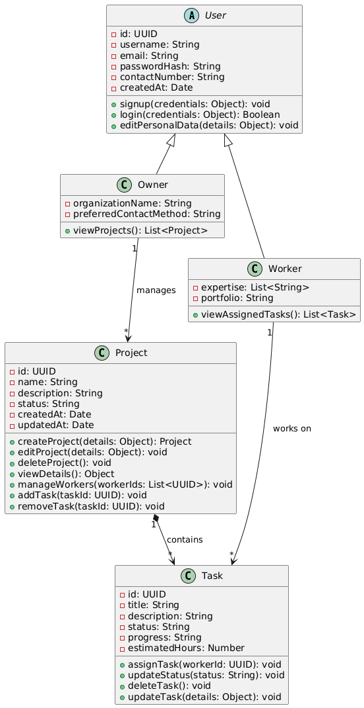
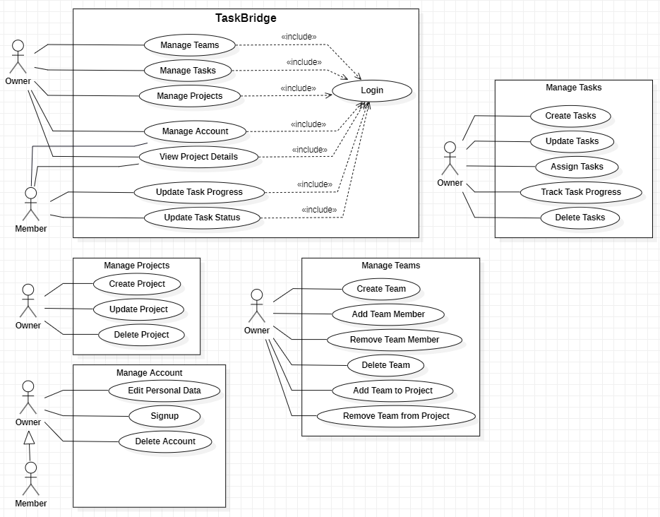

---

**TaskBridge** is an intuitive project and task management tool built to streamline collaboration and enhance productivity. Designed as a learning project using **Node.js**, it provides a role-based system tailored for project owners and workers.

---

### **📋 Features**

#### **🔒 Owner Interface**

-   **Project Management:**
    -   Create, edit, and delete projects.
    -   View project details and track overall progress.
-   **Task Management:**
    -   Create, update, and delete tasks.
    -   Assign deadlines and monitor task progress.
-   **Profile Management:**
    -   Update personal details such as username and email.
-   **Authentication:**
    -   Secure login/signup for project owners.

#### **🧑 Worker Interface**

-   **Task Management:**
    -   View assigned tasks and task details.
    -   Update task status to reflect progress.
-   **Profile Management:**
    -   Edit personal information (e.g., username, email, expertise).
-   **Authentication:**
    -   Role-based secure login for workers.

---

### **🚀 Tech Stack**

| **Category**        | **Technology**                      |
| ------------------- | ----------------------------------- |
| Backend Framework   | Node.js, Express.js                 |
| Database            | MongoDB, Mongoose                   |
| Frontend Templating | EJS                                 |
| Styling             | Tailwind CSS                        |
| Authentication      | JSON Web Tokens (JWT), bcrypt       |
| Utilities & Tools   | dotenv, helmet, compression, morgan |
| Logging             | Winston                             |

---

### **🔧 Project Structure**

```
TaskBridge/
├── config/                # Database configuration
├── controllers/           # Application logic
├── logs/                  # Log files
├── middlewares/           # Request handling middleware
├── models/                # Mongoose schemas
├── routes/                # API endpoints
├── utils/                 # Utility functions
├── views/                 # EJS templates
├── app.js                 # App configuration
├── server.js              # Server entry point
├── package.json           # Dependencies and scripts
```

---

### **📊 UML Diagrams**

#### **Class Diagram**



#### **Use Case Diagram**



---

### **⚙️ Installation and Setup**

#### **Prerequisites**

-   **Node.js** (v16+)
-   **MongoDB**

#### **Steps**

1. Clone the repository:
    ```bash
    git clone https://github.com/Yassinekrn/Project-Management-Web-Application.git
    cd Project-Management-Web-Application
    ```
2. Install dependencies:
    ```bash
    npm install
    ```
3. Configure the environment:  
   Create a `.env` file in the root directory:
    ```env
    MONGO_URI=mongodb://localhost:27017/<your_db_name>
    JWT_SECRET=<your_secret_key>
    NODE_ENV=development
    PORT=3000
    ```
4. Run the application:
    ```bash
    npm run dev
    ```
    The server will be live at `http://localhost:3000`.

---

### **✨ Future Enhancements**

-   Implement detailed task analytics and reports.
-   Add calendar integration for task deadlines.
-   Enable notifications for task updates.
-   Build a mobile-friendly interface.

---

### **📝 License**

This project is licensed under the MIT License. See the [LICENSE](link_to_license) file for details.

---

### **💬 Contributing**

We welcome contributions!

-   Fork the repository.
-   Create a feature branch: `git checkout -b feature/<feature_name>`.
-   Commit changes: `git commit -m "Add <feature_name>"`.
-   Push to the branch: `git push origin feature/<feature_name>`.
-   Open a pull request.

---

**TaskBridge**: Streamline your projects, collaborate better. ✨
